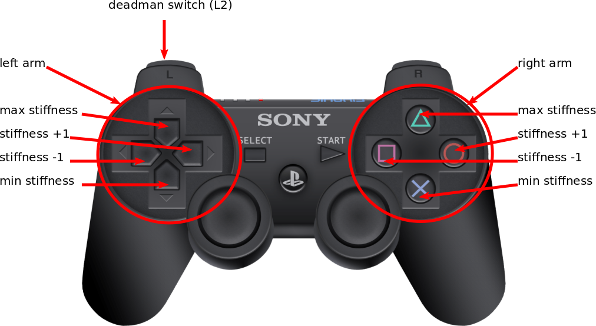

# boxy_zero_gravity
Run

```roslaunch boxy_zero_gravity boxy_zero_gravity.launch```

to start the node. It assumes, that the stiffness is set to [400, 400, 400, 300, 200, 200, 200] for both arms because this
information is not published anywhere.
You should therefore take care when you change the stiffness for the first time.

## Controlls


